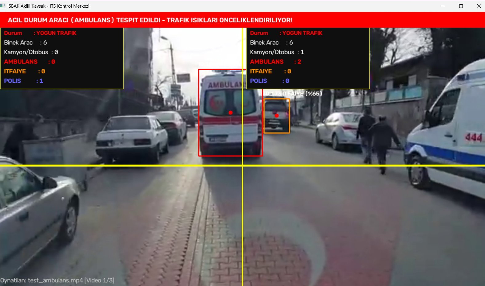
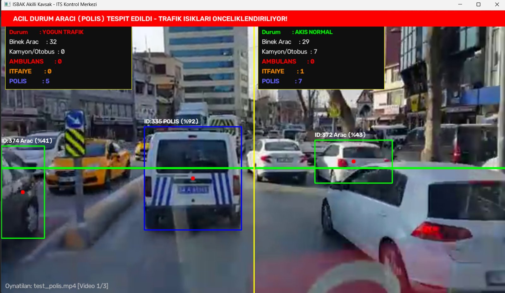
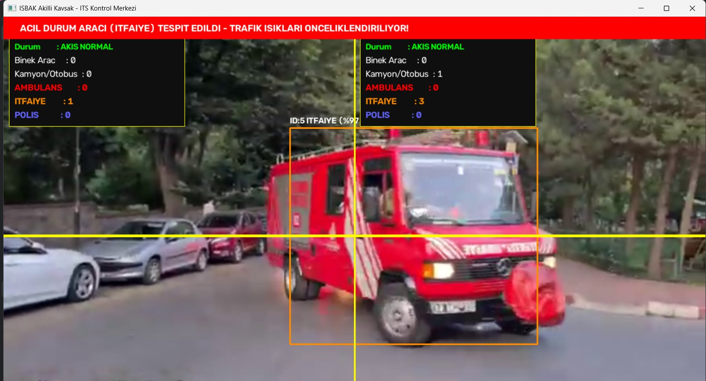
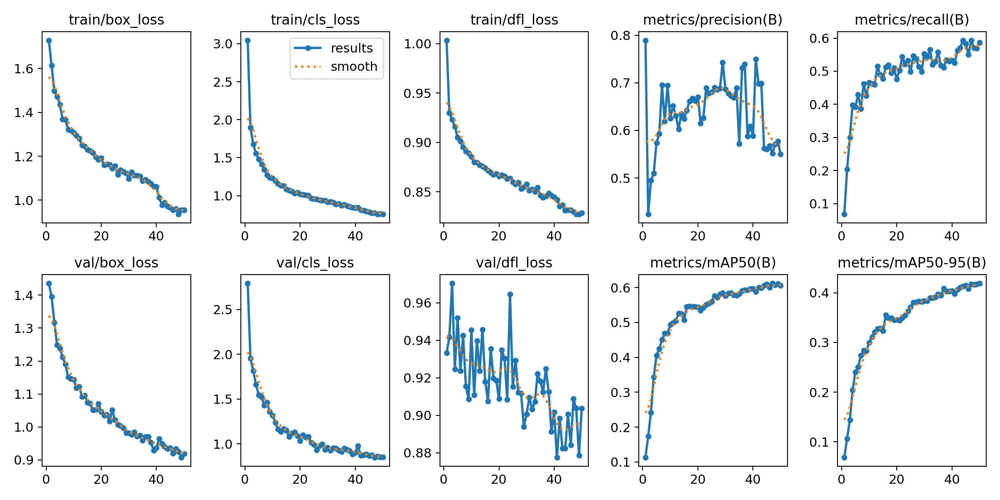
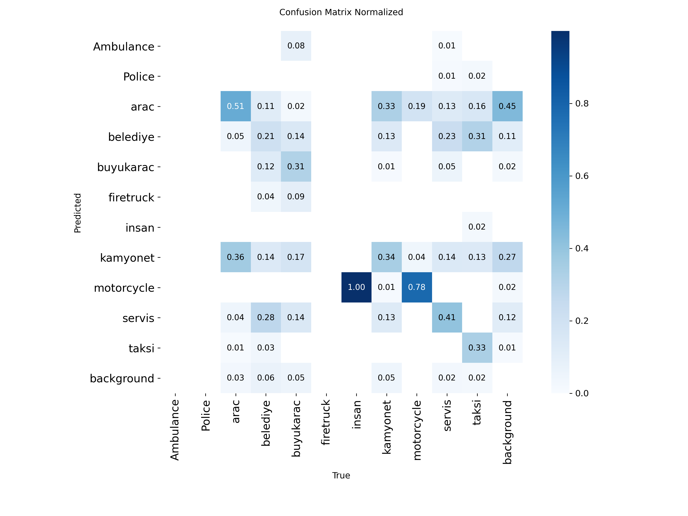
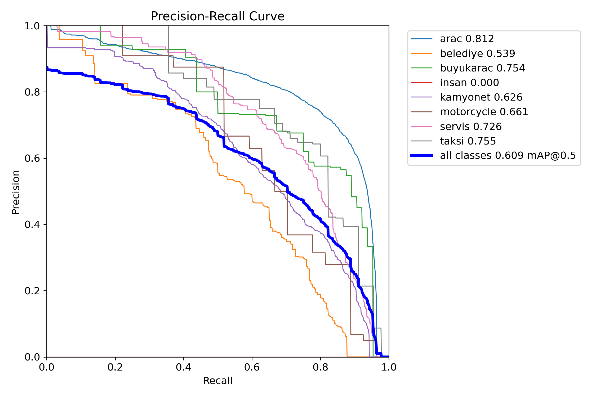
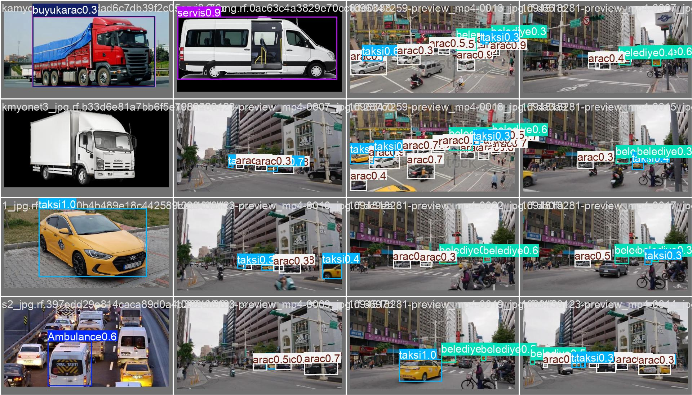

# 🚦 Smart Intersection: Traffic Density Analysis and Emergency Vehicle Prioritization

A computer-vision system that counts vehicles per lane at an intersection, measures traffic density, and detects **ambulances, fire trucks and police cars** in real time, raising a traffic-light priority alarm when one appears.

> This is a personal project I built on my own computer during my summer 2026 internship at İSBAK. It is not an official İSBAK product and contains no company data. All tests were run on publicly available videos.

<p align="center">
  
  
  
</p>

## Features

- **Custom-trained YOLOv8n model** with 11 classes: ambulance, police car, fire truck, car, taxi, shuttle, van, heavy vehicle, municipal vehicle, motorcycle and pedestrian. I hand-labeled 100 images for each emergency class and merged them with a public vehicle dataset.
- **ByteTrack multi-object tracking:** every vehicle gets a unique ID, so it is not counted again on every frame.
- **Lane-based counting:** the left half of the frame is the *inbound* lane and the right half is the *outbound* lane. Vehicles are counted separately by type.
- **Wide capture zone:** a 140 px band is used instead of a thin line, so fast vehicles are not missed between two frames. A 4-second lock prevents the same ID from being counted twice.
- **Calibrated confidence thresholds:** 55% for police and 45% for ambulance and fire truck, tuned for compressed video and CCTV footage.
- **Priority alarm:** when an emergency vehicle enters the counting zone, a red banner is shown for 5 seconds.
- **Time-locked density status:** a lane is marked *HEAVY* at 3 or more vehicles and *NORMAL* at 1 or fewer. Once the status changes, it stays for at least 5 seconds, so the display does not flicker.
- **Playlist mode:** several videos are analyzed back to back with cumulative counters. Press `N` to skip to the next video and `Q` to quit.

## Model Performance

YOLOv8n, 50 epochs, 640 px images, batch size 16, trained on Google Colab. Values are on the validation set, averaged over all 11 classes:

| Metric | Value |
|---|---|
| mAP@50 | **0.61** |
| mAP@50-95 | **0.42** |
| Precision | 0.55 |
| Recall | 0.59 |

<p align="center">
  
</p>

<details>
<summary>Confusion matrix, PR curve and sample predictions</summary>

 

</details>

## Installation

```bash
git clone https://github.com/ysresraaa/ISBAK-Smart-Intersection-System.git
cd ISBAK-Smart-Intersection-System
pip install -r requirements.txt
```

## Usage

```bash
# 1) Download the test videos (saved to videos/)
python tools/download_test_videos.py

# 2) Run the system: plays every .mp4 in videos/ in order
python smart_intersection.py

# Specific videos, a webcam, or custom thresholds
python smart_intersection.py --videos videos/test_police.mp4 videos/test_fire_truck.mp4
python smart_intersection.py --source 0
python smart_intersection.py --police-conf 0.6 --emergency-conf 0.5
```

## Project Structure

```
├── smart_intersection.py         # Main application (custom model + tracking + counting + alarm)
├── models/best.pt                # Trained YOLOv8n weights (~6 MB)
├── baseline/
│   ├── vehicle_counting_coco.py  # First version: direction/type counting with the COCO model
│   └── streamlit_app.py          # Streamlit web dashboard for the first version
├── tools/download_test_videos.py
├── videos/                       # Test videos (not included in the repo)
└── docs/images/                  # Screenshots and training plots
```

## Problems Solved During Development

| Problem | Solution |
|---|---|
| Fast vehicles skipped the thin counting line between two frames | 140 px capture band plus a per-ID time lock |
| A high confidence threshold missed real ambulances in compressed videos | Thresholds recalibrated for field conditions, plus keyword-based class matching |
| The status text kept flickering when traffic was near the threshold | Hysteresis plus a 5-second status lock |
| Video downloads failed because audio and video came as separate streams | Switched to a single-file (progressive) MP4 format |

## Tech Stack

Python · Ultralytics YOLOv8 · ByteTrack · OpenCV · Streamlit · Google Colab · Roboflow

## License

MIT
